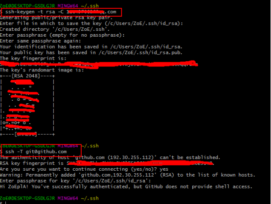

# WEB:
基础：首先得对Web方面有个基本的概念，了解基本的数据库、编程语言、Web服务器和Web应用程序；
- 数据库主要是mysql，得熟悉SQL语句；（注入和理解一些网站或者软件的设计原理尤为重要）
- 编程语言：python、php、html、JavaScript（懂编程语言，不仅需要用来看懂源码，懂其中的原理，还可以自己写脚本来破解，对整个CTF或者是从事安全方面IT行业的人来说都是重要的一个方面）
- Web服务器：apache（了解apache服务器的配置方法和一些常用配置）
- Web应用程序：wordpress（实现网站制作）
漏洞：DVWA，攻破不同等级的不同漏洞。还可以经常关注freebuf、安全客和合天等大型企业平台，学习尝试复现一些漏洞，建议一定要在虚拟机中复现；通过查看博客收集资料等方式，尝试复现一些经典漏洞。

做笔记是必须的，第一加深当时的学习记忆，第二可以方便之后的查阅。

Github是一个非常牛逼的一个平台，把自己的知识储存好同时分享出来，是众多大神选择的平台，所以在上面可以查找到一些比较好的博文知识介绍，同时github也是一个丰富的工具库和各种开源项目。

#### git教程：
https://www.liaoxuefeng.com/wiki/0013739516305929606dd18361248578c67b8067c8c017b000

rm -rf 文件    //删除文件
#### 创建版本库：

发现当前目录下多了一个.git的目录，这个目录是Git来跟踪管理版本库的，没事千万不要手动修改这个目录里面的文件，不然改乱了，就把Git仓库给破坏了。
如果你没有看到.git目录，那是因为这个目录默认是隐藏的，用ls -ah命令就可以看见。

看到这个吓到我了：
######使用Windows的童鞋要特别注意：
千万不要使用Windows自带的记事本编辑任何文本文件。原因是Microsoft开发记事本的团队使用了一个非常弱智的行为来保存UTF-8编码的文件，他们自作聪明地在每个文件开头添加了0xefbbbf（十六进制）的字符，你会遇到很多不可思议的问题，比如，网页第一行可能会显示一个“?”，明明正确的程序一编译就报语法错误，等等，都是由记事本的弱智行为带来的。建议你下载Notepad++代替记事本，不但功能强大，而且免费！记得把Notepad++的默认编码设置为UTF-8 without BOM即可：
所提交到仓库的文档，必须要在文件夹的路径中

git安装时会自带一个git bash工具，用起来感觉比cmd方便。可今天发现一个问题，用git bash无法创建文件夹和文件。在cmd下，只需要 md+文件夹名 就可以创建一个文件夹，可md在git bash下是无效的命令。
原因是cmd和git bash是两个完全不同的工具，cmd用的是Windows自己的命令，而git bash用的是linux下的命令。
在git bash新建文件夹命令是 mkdir+文件夹名。
新建文件有两种方式：
- 1，touch+文件名，直接新建一个文件
- 2，vi+文件名，新建一个文件并进入编辑状态（如果文件已存在，则直接进入编辑状态）

vi其实是linux的一个文本编辑器，所以 vi+文件名 后，其实是进入vi程序了。vi有两种模式，编辑模式和命令模式

第一次修改 -> git add -> 第二次修改 -> git commit
Git管理的是修改，当你用git add命令后，在工作区的第一次修改被放入暂存区，准备提交，但是，在工作区的第二次修改并没有放入暂存区，所以，git commit只负责把暂存区的修改提交了，也就是第一次的修改被提交了，第二次的修改不会被提交。

在本地创建ssh,提交到github上，把本地库和github连接起来。

查看分支：git branch
创建分支：git branch <name>
切换分支：git checkout <name>
创建+切换分支：git checkout -b <name>
合并某分支到当前分支：git merge <name>
删除分支：git branch -d <name>

合并分支时，加上--no-ff参数就可以用普通模式合并，合并后的历史有分支，能看出来曾经做过合并，而fast forward合并就看不出来曾经做过合并。
